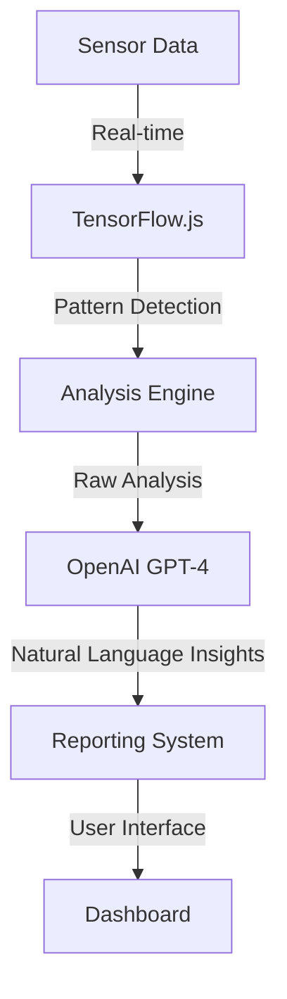

# GOSPL AI System

## Overview

GOSPL's AI system combines OpenAI's language models with custom machine learning for comprehensive gait analysis and medical insights. This hybrid approach enables both real-time pattern detection and sophisticated natural language reporting.

## System Architecture



## Core Components

### 1. Real-time Analysis (TensorFlow.js)
```typescript
// packages/ai/src/analysis/gait-processor.ts
import * as tf from '@tensorflow/tfjs';

export class GaitPatternAnalyzer {
  private model: tf.LayersModel;

  async analyzePattern(sensorData: SensorReading[]): Promise<PatternAnalysis> {
    const tensor = this.preprocessData(sensorData);
    const prediction = await this.model.predict(tensor);
    return this.interpretPrediction(prediction);
  }

  private preprocessData(data: SensorReading[]): tf.Tensor {
    // Convert sensor readings to tensor format
    return tf.tensor(data.map(reading => [
      reading.pressure,
      reading.acceleration.x,
      reading.acceleration.y,
      reading.acceleration.z
    ]));
  }
}
```

### 2. OpenAI Integration
```typescript
// packages/ai/src/reporting/insight-generator.ts
import { OpenAI } from 'openai';

export class InsightGenerator {
  private openai: OpenAI;

  async generateInsights(analysis: PatternAnalysis): Promise<MedicalInsight> {
    const completion = await this.openai.chat.completions.create({
      model: "gpt-4",
      messages: [
        {
          role: "system",
          content: "You are a gait analysis expert providing medical insights."
        },
        {
          role: "user",
          content: this.formatAnalysisPrompt(analysis)
        }
      ],
      functions: [{
        name: "generateMedicalReport",
        parameters: {
          type: "object",
          properties: {
            findings: { type: "array" },
            recommendations: { type: "array" },
            riskLevel: { type: "string" }
          }
        }
      }]
    });

    return this.parseCompletion(completion);
  }
}
```

## Analysis Capabilities

### 1. Gait Pattern Detection
- Stride length analysis
- Balance assessment
- Pressure distribution
- Movement symmetry

### 2. Anomaly Detection
- Fall detection
- Irregular patterns
- Fatigue indicators
- Balance issues

### 3. Trend Analysis
- Long-term changes
- Progress tracking
- Risk prediction
- Pattern correlation

## Report Generation

### 1. Physician Reports
```typescript
export interface PhysicianReport {
  technicalMetrics: {
    gaitSpeed: number;
    strideLength: number;
    balanceScore: number;
  };
  clinicalFindings: string[];
  recommendations: string[];
  attachments: Analysis[];
}
```

### 2. Caregiver Reports
```typescript
export interface CaregiverReport {
  status: 'normal' | 'attention' | 'urgent';
  summary: string;
  actionItems: string[];
  nextSteps: string[];
}
```

### 3. Family Reports
```typescript
export interface FamilyReport {
  overallStatus: string;
  simpleMetrics: {
    dailyActivity: string;
    stabilityTrend: string;
  };
  recommendations: string[];
}
```

## Integration Guidelines

### 1. Data Flow
```typescript
// Example of data flow integration
export class GaitAnalysisService {
  async processGaitData(patientId: string, data: SensorData) {
    // Real-time analysis
    const patterns = await this.patternAnalyzer.analyze(data);
    
    // Generate insights
    const insights = await this.insightGenerator.generate(patterns);
    
    // Store results
    await this.storageService.saveAnalysis(patientId, {
      patterns,
      insights,
      timestamp: new Date()
    });
    
    // Trigger notifications if needed
    if (insights.requiresAttention) {
      await this.notificationService.alert(patientId, insights);
    }
  }
}
```

### 2. API Usage
```typescript
// Example of API integration in components
export const usePatientAnalysis = (patientId: string) => {
  const queryClient = useQueryClient();
  
  return useQuery(['analysis', patientId], async () => {
    const service = new GaitAnalysisService();
    return service.getLatestAnalysis(patientId);
  }, {
    // Update every minute for real-time monitoring
    refetchInterval: 60000,
    // Keep previous data while fetching
    keepPreviousData: true
  });
};
```

## Security & Privacy

### 1. Data Protection
- End-to-end encryption
- Secure API endpoints
- Access control
- Audit logging

### 2. Model Security
- Input validation
- Output sanitization
- Rate limiting
- Version control

## Performance Optimization

### 1. Real-time Processing
- Edge computing
- Data batching
- Caching strategies
- Load balancing

### 2. Resource Management
- Model optimization
- Memory efficiency
- API quota management
- Cost optimization

## Monitoring & Metrics

### 1. System Health
```typescript
export interface AIMetrics {
  processingTime: number;
  modelAccuracy: number;
  apiLatency: number;
  errorRate: number;
}
```

### 2. Quality Assurance
- Accuracy tracking
- Error monitoring
- User feedback
- Performance metrics

## Development Guidelines

### 1. Model Training
- Data preparation
- Validation methods
- Testing procedures
- Deployment process

### 2. Integration Testing
```typescript
describe('AI System Integration', () => {
  it('processes gait data correctly', async () => {
    const service = new GaitAnalysisService();
    const result = await service.processGaitData('test-patient', mockData);
    
    expect(result.patterns).toBeDefined();
    expect(result.insights).toMatchSnapshot();
  });
});
```

## Future Enhancements

### 1. Planned Features
- Advanced pattern recognition
- Predictive analytics
- Multi-sensor fusion
- Personalized insights

### 2. Research Areas
- Machine learning optimization
- Novel gait parameters
- Risk prediction models
- Clinical validation 