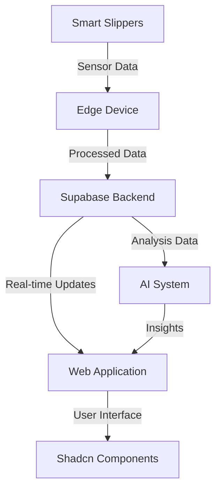

# GOSPL Technical Stack

## Core Technology Choices

### Frontend Framework
- **Next.js**: React framework for the web application
- **TypeScript**: For type safety and better developer experience
- **Tailwind CSS**: For utility-first styling

### UI Component System
- **Shadcn/ui**: Primary component foundation
  - Built on Radix UI primitives
  - Highly accessible components
  - Customizable through Tailwind
  - Copy-paste approach for maximum flexibility

### AI & Analytics
- **Hybrid AI System**:
  - OpenAI GPT-4: Natural language insights and reporting
  - TensorFlow.js: Real-time gait pattern analysis
  - Custom ML Models: Specialized pattern recognition

### Backend & Data
- **Supabase**: Backend as a Service
  - PostgreSQL database
  - Real-time subscriptions
  - Authentication
  - Row Level Security

## System Architecture



## Component Organization

```
packages/
├── ui/                      # UI Component Library
│   ├── core/               # Shadcn base components
│   ├── medical/            # Healthcare-specific components
│   └── theme/              # GOSPL theme configuration
├── ai/                     # AI & Analytics
│   ├── analysis/          # Gait analysis models
│   ├── reporting/         # Report generation
│   └── visualization/     # Data visualization
└── shared/                # Shared utilities
    ├── types/            # TypeScript definitions
    └── constants/        # Shared constants
```

## Key Integration Points

### 1. UI Component System
```typescript
// Example of customized Shadcn component
import { Button } from "@/components/ui/button"

export const GosplButton = React.forwardRef<HTMLButtonElement, ButtonProps>(
  ({ variant = "default", ...props }, ref) => {
    return (
      <Button
        ref={ref}
        variant={variant}
        className={cn(
          "font-acumin",
          "data-[state=active]:bg-primary-blue",
          props.className
        )}
        {...props}
      />
    )
  }
)
```

### 2. AI System Integration
```typescript
// Example of AI analysis integration
import { GaitAnalyzer } from '@gospl/ai';

export const useGaitAnalysis = (patientId: string) => {
  const analyzer = new GaitAnalyzer();
  
  return useQuery(['gait', patientId], async () => {
    const data = await analyzer.analyzeGaitPattern(patientId);
    return analyzer.generateInsights(data);
  });
};
```

## Performance Considerations

### UI Performance
- Component code-splitting
- Image optimization
- Responsive loading strategies
- Efficient state management

### AI Processing
- Edge computing for real-time analysis
- Batch processing for detailed reports
- Caching of common insights
- Progressive loading of visualizations

## Security Measures

### Data Protection
- End-to-end encryption
- HIPAA compliance
- Secure data transmission
- Role-based access control

### AI Security
- Model input validation
- Output sanitization
- Rate limiting
- Audit logging

## Monitoring & Analytics

### System Health
- Component performance metrics
- API response times
- Error tracking
- Usage analytics

### AI Metrics
- Model accuracy
- Processing latency
- Insight quality
- User feedback tracking 